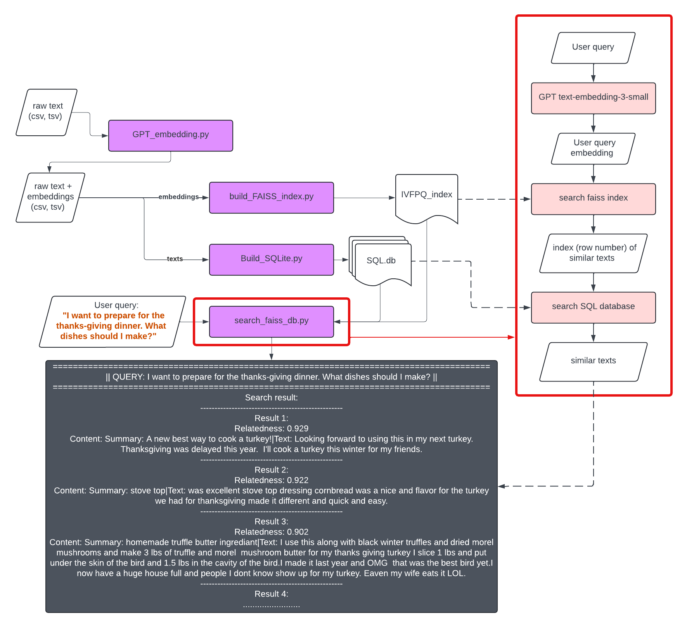

# GPT embedding

This repo contains codes needed for embedding and searching using Openai embedding model. Main scripts are the following:
 - `GPT_embedding.py`: CLI tool that retrieves embedding from GPT embedding API with multiprocessing.
 - `build_FAISS_index.py`: builds FAISS index on the embedding vectors, uses IVFPQ and [reservior sampling](https://gist.github.com/mdouze/92c5bafcf2b91356cf5e799e3889a0e9).
 - `build_SQLite.py`: builds text data into SQLite database.
 - `faiss_search.py`: (currently `faiss_search_CLI.py`) CLI tool that search a user query within the builded embedding data.

The general workflow looks like this




## Requirement

Openai API key is needed. Save your API key in `.env` in the same folder with the script, it should look like
```
OPENAI_API_KEY=<your openai key>
```
The full testing data set is [Amazon Fine Food Review](https://www.kaggle.com/datasets/snap/amazon-fine-food-reviews).

## GPT Embedding Usage
`GPT_embedding.py` retrieves embedding from GPT embedding API using `text-embedding-3-small` model, which transform input strings into a float vector of 1572 elements. The embedded data will have added `embedding` column. 

```
GPT_embedding.py -h
usage: GPT_embedding.py [-h] -i INPUT_FILE -o OUTPUT_FILE [--out_format {csv,tsv}] [-c COLUMNS [COLUMNS ...]] [--chunk_size CHUNK_SIZE] [--minimize] [--process PROCESS]

Generate GPT embeddings for text data.

options:
  -h, --help            show this help message and exit
  -i INPUT_FILE, --input_file INPUT_FILE
                        Path to the input file, accepts .csv or .txt with tab as separator.
  -o OUTPUT_FILE, --output_file OUTPUT_FILE
                        Path to the output file.
  --out_format {csv,tsv}
                        Output format: 'csv' or 'tsv' (default: csv).
  -c COLUMNS [COLUMNS ...], --columns COLUMNS [COLUMNS ...]
                        Column names to combine.
  --chunk_size CHUNK_SIZE
                        Number of rows to load into memory at a time. By default whole file will be load into the memory.
  --minimize            Minimize output to only the combined and embedding columns.
  --process PROCESS     Number of processes to call. Default will be 1 process per vCPU.
```
An example to run on small sample:
```
python GPT_embedding.py -i data/Reviews_1k.csv -o test_embedding_1k.csv --out_format csv -c Summary Text --chunk_size 500
```


## Search with user query

### File with <10k rows
To search for similarity in small embedding data (<10k rows) use `similarity_search_5k.py`, FAISS index and SQL db is not needed for this method. In script change the variable to your query
```
# Change this to your string
str_to_search = "what pizza flavor do people like the most?"
```

This method will go through every line and finds the most similar vectors to retreive.

### Large files
For larger data where brute force search is not possible, `build_FAISS_index.py` can be used to build FAISS index using IVFPQ method. This will significantly reduce the size to query on as well as the query time.

### `build_FAISS_index.py`

#### Choosing Parameters for Building a FAISS Index
When building a FAISS index, selecting the correct parameters is crucial for balancing accuracy and performance. Below are some guidelines for choosing the parameters used in the build_FAISS_index.py script:

- `dimension`: The number of elements in a single vector. 1536 for `text-embedding-3-small` and 3072 for `text-embedding-3-large`. This number can be specified when calling embedding models.
- `chunk_size`: This parameter determines the number of rows read from the CSV file at a time. A larger chunk size can speed up the reading process but requires more memory. Adjust based on your system's memory capacity.

- `nlist`: This parameter represents the number of Voronoi cells (clusters) to divide the data into. It is calculated as the square root of the number of rows (nrow).
  - **Higher nlist**: Increases accuracy but decreases search speed.
  - **Lower nlist**: Decreases accuracy but increases search speed.
  - **Guideline**: Start with `nlist = int(sqrt(nrow))` and adjust based on your accuracy and performance needs.
- `nsubvec`: This parameter is the number of sub-vectors into which each vector is divided. It must be a divisor of the vector dimension (dimension).
  - **Higher nsubvec**: Increases the granularity of the quantization, which can improve accuracy but also increases the complexity and memory usage.
  - **Lower nsubvec**: Reduces the granularity, which can decrease accuracy but also reduces complexity and memory usage.
  - **Guideline**: Ensure `dimension % nsubvec == 0`. Common choices are powers of 2 (e.g., 16, 32, 64).
- `nbits`: This parameter determines the number of bits used for each sub-vector. It affects the number of centroids (clusters) each sub-vector can be quantized into, which is 2^nbits.
  - **Higher nbits**: Increases the number of centroids, improving accuracy but also increasing memory usage and computational complexity.
  - **Lower nbits**: Decreases the number of centroids, reducing memory usage and computational complexity but also decreasing accuracy.
  - **Guideline**: Common choices are 8 or 16 bits. Start with 8 bits and adjust based on your accuracy and performance requirements.

#### Example Configuration
For a dataset with 568,428 rows and a vector dimension of 1536:

- `chunk_size`: 10,000 (adjust based on memory capacity)
- `nlist`: 754 (calculated as int(sqrt(568428)))
- `nsubvec`: 96 (ensure it divides 1536 evenly)
- `nbits`: 8 (start with 8 and adjust if necessary)

### `build_SQLite.py`
After building the faiss index, it is also needed to build text data into a SQL database to accelerate retrival speed.

(will add more detail later)

### `search_faiss_CLI.py`
This script provides a command-line interface (CLI) for performing a FAISS-based search on a SQLite database. 
```
python faiss_search_CLI.py -h
usage: faiss_search_CLI.py [-h] [--query QUERY] [--db DB] [--index INDEX] [--top TOP] [--verbose]

Faiss Search CLI

options:
  -h, --help            show this help message and exit
  --query QUERY, -q QUERY
                        Query string
  --db DB               Database file path
  --index INDEX, -x INDEX
                        Index file path
  --top TOP, -n TOP     Number of results to return (default: 5)
  --verbose, -v         Print verbose output
```

The function takes 3 required arguments:
- `--query/-q`: A single string to be searched within the database.
- `--db`: Path to the SQL database.
- `--index/-x`: Path to the FAISS IVFPQ index.

The `--verbose/-v` option will return a human-readable texts (the example output in the flowchart), disabling the `-v` option will print the result line by line, which are easier to be read by other scripts.


Here's an example usage to search for a random query with pre-built database `Reviews.db` and IVFPQ index `IVFPQ_index.bin`:
```
python3 GPT_embedding/faiss_search_CLI.py --query "Recommand me some spicy chinese food\n" --db /path/to/Reviews.db --index /path/to/IVFPQ_index.bin --top 5 -v
```


## Benchmark
The testing data [Amazon Fine Food Review](https://www.kaggle.com/datasets/snap/amazon-fine-food-reviews) have 568428 rows, and size of 290M.

The testing data after embedding is 19G in size.

The IVFPQ index is around 60M, the SQLite database is around 300M (with just 1 row of combined columns)

568428 rows / 19.5G = 29150.1538 row/G

### Determine --chunk_size parameter for `GPT_embedding.py`

To run with 3G of RAM and 12 processes (via multiprocessing), the `chunksize` parameter should no greater than

29150.1538 row/G * 3 G = 87450 rows/proc

While in practice this number can be set at most 1/2 of the maximum, to allow worst situations. Here's an example code to build embedding for testing data on server
```
nohup python3 GPT_embedding/GPT_embedding.py -i GPT_embedding/Reviews_1k.csv -o /disk3/GPT_embedding_output/Reviews_embedding.csv --out_format csv -c Summary Text --chunk_size 10000 --process 12 > process.log 2>&1 &
```
This will call the script to run in background. To see all the processes that are running, use
```
ps aux | grep GPT_embedding.py

## To kill all the processes running
ps aux | grep GPT_embedding.py | grep -v grep | awk '{print $2}' | xargs kill
```

You can occasionally check the progress by checking the tail of `process.log`
```
tail -n 50 process.log
```


